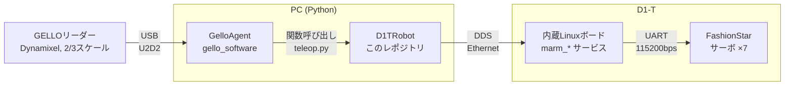
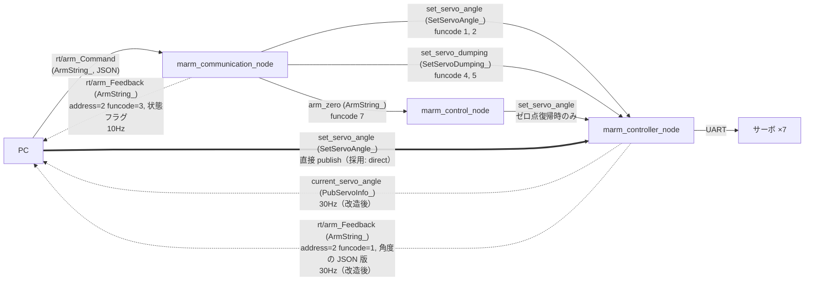

# d1t-teleop

[GELLO](https://github.com/wuphilipp/gello_software) を使って Unitree D1-T をテレオペするためのレポジトリ。

---

## 環境構築
```bash
git submodule update --init --recursive
export UV_PROJECT_ENVIRONMENT=$HOME/.venvs/d1t-teleop   # macOS: ~/.zshrc に書く。Desktop 以下の .venv は .pth が hidden 扱いされ import できない
uv sync
```

## 使い方

```bash
uv run python scripts/limp.py --nic en10        # 必要なら D1 を脱力させて手でデフォルト姿勢に戻す
uv run python scripts/teleop.py --gello-port /dev/cu.usbserial-FTAAMM7U --nic en10 --use-d1          # dry-run
uv run python scripts/teleop.py --gello-port /dev/cu.usbserial-FTAAMM7U --nic en10 --use-d1 --live   # 実機
```

- 起動時に D1 をリーダーの姿勢まで 20°/s で動かすので、リーダーを D1 の姿勢に合わせてから起動する
- `[warn] D1 state is ... old` が出たら止める
- ⚠️ 実機を動かすときは、周りに何もなく非常停止（電源）に手が届く状態で

## ファイル構成

```
d1t_teleop/
  msg.py         D1 の DDS 型（ArmString_, PubServoInfo_, SetServoAngle_, SetServoDumping_）を Python に移植
  config.py      リーダー(GELLO)のキャリブ値、D1 の関節リミット・グリッパ範囲・送信設定
  d1t_robot.py   D1TRobot: GELLO の Robot プロトコル実装。送信は direct + sync（dry-run 既定）
scripts/
  probe_d1.py    読み取り専用。D1 の状態トピックの受信周期（平均/最小/最大間隔）と値を表示
  read_leader.py GELLO リーダーの生の角度を表示（接続・ID・回転方向の確認用）
  compare_live.py D1 とリーダーの角度を並べて表示するウィンドウ（joint_signs 決め用、読み取り専用）
  leader_offset.py リーダーのオフセット計算（gello_get_offset.py の ID 0 始まり版）
  cmd_test.py    1関節だけ動かして追従・遅れ・フィードバックの乱れを測る（dry-run 既定、--live で実送信）
  teleop.py      GELLO → D1 テレオペ（dry-run 既定、--live で実送信）
logs/            cmd_test.py のログ（git管理外）
third_party/
  gello_software/        submodule
  unitree_sdk2_python/   submodule
vendor/          D1-T から scp したもの（D1 上で変更する前の元の状態）
  marm_code/                 ドライバ（ROS なし、unitree_sdk2 C++ + CycloneDDS）。build/ は元の marm_controller_node のみ
  fashionstar-uart-servo-cpp/ サーボのシリアル通信ライブラリ
  autoStart*.sh              各ノードの起動スクリプト
```

---

## 構成



- 2/3スケールでも問題なし（GELLOは関節角をそのまま写すだけ）。必要なのは `joint_offsets` / `joint_signs` のキャリブレーションのみ
- グリッパ: D1-T純正（J6）。GELLOのトリガー値 0〜1 を J6 の角度範囲に線形マッピングする

## 決定事項

| 項目 | 決定 | 理由 |
|---|---|---|
| ROS2 | 使わない | まずシンプルに。必要になったら後で被せる |
| シミュレータ | 使わない | 不要 |
| 言語 | Python のみ | GELLO本体は純Python（C++はROS2版Franka用のみで無関係） |
| D1との通信 | unitree_sdk2_python (cyclonedds) で DDS を直接 publish/subscribe | D1のメッセージ型(IDL)だけPythonに移植すれば済む |
| 実装方針 | GELLOの `Robot` プロトコル（`gello/robots/robot.py`）を満たす `D1TRobot` を書く | 通信方式を変えても中身の差し替えだけで済む |
| フィードバック周期 | **30Hz 固定周期**（D1 側を改造、[下記](#d1-t-上で行った変更)） | 元は約9Hz。30Hz ならシリアルバスの約1/3で済み、指令書き込みの余裕が残る。カメラ 30fps とも揃う |
| 指令経路 | **direct**: `set_servo_angle` に `SetServoAngle_` ×7 を直接 publish（JSON の `rt/arm_Command` は使わない） | `marm_communication_node` を経由しない分、遅れが約15ms 小さい。`delay_ms` も指定できる |
| 指令タイミング | **sync**: `current_servo_angle` を受けた直後に1回送る（= 30Hz） | D1 はシリアルの読み書きを排他していない。読み取り直後の空き時間に書けば衝突しない（「指令の実測」の節）。PC のタイマーで送ると約330ms のフィードバック停止が頻発した |

`Robot` プロトコルで必要なメソッド: `num_dofs()`, `get_joint_state()`（rad, グリッパは0〜1）, `command_joint_state(q)`, `get_observations()`（`joint_positions`, `joint_velocities`, `ee_pos_quat`, `gripper_position`）。

---

## D1-T について分かっていること

### 接続

| 項目 | 値 |
|---|---|
| D1-T の IP | `192.168.123.100` |
| ログイン | `ssh ubuntu@192.168.123.100`（パスワード `123`） |
| sudo | パスワード不要（`/etc/rc.local` で sudo に setuid を付けている） |
| PC 側 | 同じ `192.168.123.0/24` に置く。Mac では `en10`（`192.168.123.111`） |
| DDS | domain 0。D1 側は NIC 指定なしの `Init(0)`、PC 側は `ChannelFactoryInitialize(0, "<NIC名>")` |

### ハードウェア
- 6DoF + グリッパ(J6) の計7サーボ。**FashionStar の UART バスサーボ**（`/dev/ttyS4`, 115200bps, ID 0〜6）
- インタフェース: RJ45 (DDS通信), Type-C (シリアルデバッグ), DC電源 24V
- 内蔵Linuxボード: 4コア, RAM 2GB。ドライバソース `~/marm_code` がありその場で `make` できる

### 内部サービス（systemd）

4つとも `/etc/systemd/system/*.service`（`User=ubuntu`, `Restart=on-failure`）が `~/autoStart*.sh` を呼び、その中で `~/marm_code/build/<ノード>` を起動する。

| サービス | 起動スクリプト | 実体 | 役割 |
|---|---|---|---|
| `marm_communication` | `autoStartCommunication.sh` | `marm_communication_node` | `rt/arm_Command` の JSON を解釈して下位トピックに流す。状態フラグを 10Hz で publish |
| `marm_control` | `autoStartControl.sh` | `marm_control_node` | ゼロ点復帰（`arm_zero`）と、0.1°刻みで補間する `set_servo_angle_control` だけ担当。常時の publish はしない |
| `marm_controller` | `autoStartController.sh` | `marm_controller_node` | サーボを直接駆動。`set_servo_angle` / `set_servo_dumping` を受けてシリアルに書き、7軸を読んで publish |
| `marm_subscripber` | `autoStartSubscriber.sh` | `subscriber` | フィードバックを標準出力に表示するだけのデバッグ用 |

```bash
systemctl status marm_communication marm_control marm_controller marm_subscripber
sudo systemctl restart marm_controller
```

### トピックと流れ（ソースで確認済み）



実線: 指令、太線: テレオペで使う経路、点線: フィードバック。

- トピック名は C++ 側でも文字列そのまま（`rt/` の自動付与なし）。**フィードバックは `rt/arm_Feedback`**。公式サンプル（`subscriber.cpp`）の `arm_Feedback` には何も届かない（実測）
- 角度の単位は **度**（GELLOはrad → 変換が必要）
- funcode 3 の状態（`enable_status` / `power_status` / `error_status`）は `marm_communication_node` 内のフラグを流しているだけで、サーボの実状態ではない。`error_status` は常に 0

### DDS の型（`vendor/marm_code/src/msg/*.hpp`）

型名はすべて `unitree_arm::msg::dds_::<名前>`。

| 型 | フィールド | 用途 |
|---|---|---|
| `ArmString_` | `string data` | JSON 指令・フィードバック |
| `PubServoInfo_` | `float32 servo0_data` 〜 `servo6_data` | 7軸の現在角 [deg] |
| `SetServoAngle_` | `int32 seq, uint8 id, float32 angle, int16 delay_ms` | 1軸の角度指令 |
| `SetServoDumping_` | `int32 seq, uint8 id, uint16 power` | 1軸のダンピング（脱力） |

`d1t_teleop/msg.py` の `ArmString_` / `PubServoInfo_` は一致（実機で受信確認済み）。`SetServoAngle_` / `SetServoDumping_` は未移植。

### JSON 指令（`rt/arm_Command`, address=1）

[marm_communication_node.cpp](vendor/marm_code/src/marm_communication_node.cpp) の `subArmCommand_callback()` より。

| funcode | data | 動作 |
|---|---|---|
| 1 | `id, angle, delay_ms` | 1軸の角度指令 |
| 2 | `angle0`〜`angle6`, `mode` | 全軸の角度指令。`mode=0`: 各軸 `delay_ms=40` 固定で即 publish。`mode=1`: 移動量から `delay_ms`（約67ms/度）を計算し、**その時間だけ受信コールバック内で sleep する**（その間は次の指令を受けない） |
| 3 | `pose_x/y/z, roll/pitch/yaw` | 受信応答を返すだけで何もしない（未実装） |
| 4 | `id, mode` | 1軸のダンピング（`mode` = power。<1000 で enable_status=0） |
| 5 | `mode` | 全軸のダンピング |
| 6 | `power` | 表示してフラグを立てるだけ |
| 7 | なし | ゼロ点復帰（全軸 0° へ 6000ms かけて移動） |

- **テレオペは funcode 2 の `mode=0`**（または `set_servo_angle` の直接 publish）を使う
- JSON のキーが欠けると rapidjson が assert で落ちる可能性がある → 必ず全キーを入れる

### `marm_controller_node` 側の処理（[marm_controller_node.cpp](vendor/marm_code/src/marm_controller_node.cpp) `subServoAngle_callback()`）

- 関節リミットでクリップ: J0 ±135, J1 ±90, J2 ±90, J3 ±135, J4 ±90, J5 ±135, **J6（グリッパ）-20〜50** [deg]
- 受け取った `delay_ms` と移動量から、角速度（上限約115°/s）・角加速度（上限約72°/s²）を計算し、サーボへの移動時間を決め直す
- 現在角が ±180° を外れていたらダンピングに切り替え
- 読み取り（タイマースレッド）と書き込み（DDS コールバック）が**排他なしで同じシリアルポートを使う**

### 周期（実測, Mac → D1, 指令なし）

| 構成 | `current_servo_angle` | 受信間隔 | `marm_controller_node` CPU |
|---|---|---|---|
| 元（100ms sleep → 読み取り） | 9.00 Hz | 平均 111ms | 35% |
| 10ms sleep | 47.7 Hz | 平均 21.0ms（19.4〜23.4） | 71% |
| **33ms 固定周期（現在）** | **30.34 Hz** | 中央値 33.0ms、99% が 31.8〜33.9ms | 44% |

- 7軸の読み取りに約 11ms（1軸約 1.6ms。6+8 バイトの往復 @115200bps）
- CPU が高いのはシリアル受信待ちがビジーループのためと思われる

---

## D1-T 上で行った変更

**D1 上の `~/marm_code` は元のソースから変更済み。**（`vendor/marm_code` は変更前の元ソース）

1. `CMakeLists.txt` 17行目の `add_executable(test ...)` をコメントアウト（`src/test.cpp` が存在せず cmake が失敗するため）
2. `src/marm_controller_node.cpp`: フィードバックを 30Hz 固定周期に（2026-09-30）

```diff
@@ class Timer_ / start()
             timer_thread_ = std::thread([this]() {
+                // Fixed-rate: wait until the next tick instead of sleeping a fixed time after the callback.
+                auto next = std::chrono::steady_clock::now();
                 while (running_) {
-                    std::this_thread::sleep_for(std::chrono::milliseconds(interval_));
+                    next += std::chrono::milliseconds(interval_);
+                    auto now = std::chrono::steady_clock::now();
+                    if (next < now) {
+                        next = now;  // overran: don't try to catch up
+                    }
+                    std::this_thread::sleep_until(next);
                     if (callback_ != nullptr) {
                         callback_();
                     }
@@ main()
-    Timer_ timer(pubServoAngle_callback, 100);
+    Timer_ timer(pubServoAngle_callback, 33);
```

元に戻す: `vendor/marm_code/src/marm_controller_node.cpp`（元ソース）を D1 に戻して再ビルド、または `vendor/marm_code/build/marm_controller_node`（元バイナリ, md5 `7d6d5522e3d997841e1accb52691aef1`）を `~/marm_code/build/` に上書きして再起動。

### D1-T 上でビルドする手順

```bash
# 1. PC から D1 の時計を合わせる（ずれていると make がリンクを飛ばし、変更が反映されない）
ssh ubuntu@192.168.123.100 "sudo date -u -s '$(date -u '+%Y-%m-%d %H:%M:%S')'"

# 2. D1 上で（build/ は root 所有なので sudo）
cd ~/marm_code/build
sudo make marm_controller_node     # 出力に "Linking CXX executable" が出ることを確認
sudo systemctl restart marm_controller

# 3. PC から周期を確認
uv run python scripts/probe_d1.py --nic en10 --duration 10 --interval 5
```

---

### 指令の実測（J0, -10〜10°, 5°/s）

`scripts/cmd_test.py --joint 0 --waypoints -10 10 --speed-deg 5 --live`。ログは `logs/`。

| | JSON, PC タイマー 30Hz | direct, PC タイマー 30Hz | **direct + sync（採用）** |
|---|---|---|---|
| フィードバック受信→送信（中央値） | 12.2 ms | 13.4 ms | **0.4 ms** |
| 指令中のフィードバック | 24.5 Hz | 25.7 Hz | **30.3 Hz** |
| 受信間隔の最大 | 427 ms | 332 ms | **34.4 ms** |
| 50ms 超の途切れ | 8回 | 9回 | **0回** |
| 遅れ | 165 ms | 150 ms | **140 ms** |
| 遅れ補正後の誤差 RMS | 0.33° | 0.30° | **0.17°** |
| 誤差の最大 | 2.91° | 2.43° | **1.02°** |

- 途切れはほぼ全部約330ms（= 33ms + サーボ応答のタイムアウト 100ms × 3）。読み取り中に書き込みが割り込んでいた
- 残る約140ms の遅れは D1 側（`marm_controller_node` の移動時間計算とサーボ応答）。PC 側では縮まらない

## 未解決・要注意

- 遅れ約140ms。詰めるなら `delay_ms`（既定 33）を変えて影響を見る
- sync は衝突の確率を下げるだけで、保証はしない（ネットワーク遅延が大きく揺れれば衝突しうる）。根本対策は `marm_controller_node` のシリアルアクセスに mutex を入れること
- グリッパ J6: 手では 70（開）〜-23.8°（閉）動くが、`marm_controller_node` のクリップで指令は -20〜50° に制限される。広げるなら D1 側の `maxangle[6]` / `minangle[6]`
- リーダーや DDS が途切れたときの停止処理はない（D1 は最後の指令位置で保持）
- 販売店スペックの「SDKで1kHz更新」「遅延15ms以下」は、このドライバ構成では当てはまらない（フィードバックは元 9Hz）

## 参考

- GELLO: https://github.com/wuphilipp/gello_software
- unitree_sdk2_python: https://github.com/unitreerobotics/unitree_sdk2_python
- D1 SDK を CMake パッケージ化した非公式レポ: https://github.com/2Nitrogen/unitree_d1_sdk_extension
- D1 公式開発ガイド（中国語）: https://support.unitree.com/home/zh/developer/D1Arm_services
